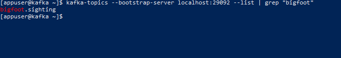

# Spring Kafka Exercise

In a Exercise 2, Spring apps that used a vanilla KafkaProducer and KafkaConsumer were used. In Exercise 3, Kafka Streams with Spring was used.

The goal of this exercise will be to use Spring Kafka. No Kafka Streams. No manual life-cycle management. Use Spring Kafka without Streams or any other higher level abstraction layer.

In this exercise, I will make a Spring Producer app that uses `KafkaTemplate` to send messages to a topic defined in a separate Kafka admin app. The topic will be sitings of "Bigfoot" all over the globe! I will then have a consumer using `KafkaListener` to consume these sighting events.

## Architecture

wip

## Local Setup/Demo

This serves as documentation for what this looks like locally.

### Prerequisites

 * Must have Docker installed.
 * Not required but demo is on Windows machine with Powershell
 * Not required but demo for run configs is on IntelliJ IDEA

#### 1. Deploy Kafka, Schema Registry and Kafka Connect

To deploy all necessary Kafka resources, open a command prompt in the `deploy-kafka-docker` directory. Run the command
```
docker-compose up -d
```

Make sure to reset your terminal/command prompt to the root directory for the rest of the demo.

#### 2. Create Topic

To create the topics, you will need to run the `kafka-admin` app. This can be done with the command
```ps
gradlew :kafka-admin:bootRun
```

Once this is done, you can run this command in Powershell to shell into the Kafka broker container.
```ps
docker exec -it kafka bash
```

From there, you can see the newly created topic with this command.
```sh
kafka-topics --bootstrap-server localhost:29092 --list | grep "bigfoot"
```



#### 3. Produce Messages

Once the topic is created, we can run the Producer. The producer will produce a fresh, random, Bigfoot sighting to go on
the `bigfoot.sighting` topic every 5 seconds.

This can be ran by the following Gradle command.
```ps
gradlew :bigfoot-sighting-producer:bootRun
```

To verify the results, you can run this command in Powershell to shell into the Kafka broker container.
```ps
docker exec -it kafka bash
```

From there, you can consume the messages with this command.
```sh
kafka-console-consumer --bootstrap-server localhost:29092 --topic bigfoot.sighting --from-beginning
```

Results will look something like this.
```
{"spotter":"Westley Casey","latitude":-75.87692,"longitude":89.76785,"sightingType":"Shaky Video"}
{"spotter":"Justice Westley","latitude":-89.05748,"longitude":72.20871,"sightingType":"Fabricated Video"}
{"spotter":"Cody Justice","latitude":65.1544,"longitude":-124.03052,"sightingType":"Grainy Camera Shot"}
```

#### 3. Consume Messages

The messages can also be consumed by the consumer app. To run this, simply run
```ps
gradlew :bigfoot-sighting-consumer:bootRun
```

Assuming the Producer is also running (since the Consumer starts at the current offset rather than beginning), logs
like this should start coming in.
```
2026-06-25T19:25:58.581-04:00  INFO 19248 --- [bigfoot-sighting-consumer] [-consumer-0-C-1] i.g.a.b.c.BigfootSightingListener        : Consumed new record JSON: {"spotter":"Dorian Bennie","latitude":-35.1767,"longitude":-2.2849884,"sightingType":"Grainy Camera Shot"}
2026-06-25T19:26:03.564-04:00  INFO 19248 --- [bigfoot-sighting-consumer] [-consumer-0-C-1] i.g.a.b.c.BigfootSightingListener        : Consumed new record JSON: {"spotter":"Caroll Casey","latitude":-41.482327,"longitude":167.07962,"sightingType":"Shaky Video"}
2026-06-25T19:26:08.572-04:00  INFO 19248 --- [bigfoot-sighting-consumer] [-consumer-0-C-1] i.g.a.b.c.BigfootSightingListener        : Consumed new record JSON: {"spotter":"Bennie Demy","latitude":-21.761337,"longitude":63.23033,"sightingType":"Unintelligible Audio Recording"}
2026-06-25T19:26:13.582-04:00  INFO 19248 --- [bigfoot-sighting-consumer] [-consumer-0-C-1] i.g.a.b.c.BigfootSightingListener        : Consumed new record JSON: {"spotter":"Cody Finn","latitude":-55.05158,"longitude":91.74539,"sightingType":"Unintelligible Audio Recording"}
2026-06-25T19:26:18.580-04:00  INFO 19248 --- [bigfoot-sighting-consumer] [-consumer-0-C-1] i.g.a.b.c.BigfootSightingListener        : Consumed new record JSON: {"spotter":"Bennie Finn","latitude":-32.813747,"longitude":86.93823,"sightingType":"Grainy Camera Shot"}
2026-06-25T19:26:23.594-04:00  INFO 19248 --- [bigfoot-sighting-consumer] [-consumer-0-C-1] i.g.a.b.c.BigfootSightingListener        : Consumed new record JSON: {"spotter":"Demy Terry","latitude":-54.394844,"longitude":97.578064,"sightingType":"Ambiguous Audio Recording"}
```